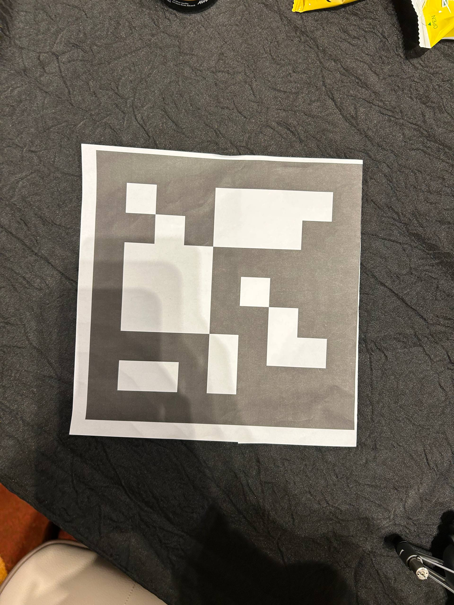

# Challenge 1 — Mapping drone

<p align="center">
<a href="{{ '/' | relative_url }}">← Home</a> &nbsp;·&nbsp;
<a href="#the-mission">Mission</a> &nbsp;·&nbsp;
<a href="#flight-envelope-hard-caps-in-the-control-loop">Envelope</a> &nbsp;·&nbsp;
<a href="#coverage-strategy--lawnmower-not-slam">Coverage</a> &nbsp;·&nbsp;
<a href="#perception--multi-dictionary-aruco">Perception</a> &nbsp;·&nbsp;
<a href="#pose--redundant-automatic-fallback">Pose</a> &nbsp;·&nbsp;
<a href="#safety-watchdogs-in-the-control-loop-not-on-a-checklist">Safety</a> &nbsp;·&nbsp;
<a href="#output--the-judge-artifact">Output</a>
</p>

> Autonomously map the arena from above and classify each landing pad as valid or invalid for landing. **Mapping speed and validity-classification accuracy** are the scored axes.

---

## The mission

A mapping drone flies over a fenced arena (≈5.5 × 11 m, see-through net walls). The arena contains five drone landing pads, each with an ArUco marker placed *beside* — not on — the pad. The marshal announces the valid + invalid marker IDs before the assessment begins.

We must produce:

1. A **top-down depth map** of the arena.
2. **An image of every ArUco marker** sighted.
3. **A classification** of each landing pad as valid or invalid.

All artifacts written to one timestamped run folder for the judges.

<p align="center">

<br><sub><i>Inside the cage on Day 1 morning — the convoy of RoboMasters with their on-body ArUco markers, against the see-through netting that defeated reactive obstacle sensing</i></sub>
</p>

---

## Flight envelope (hard caps in the control loop)

| Constraint | Value | Source |
|---|---|---|
| Horizontal speed | **0.3 m/s** | Org rule, slide 5 |
| Default altitude | 2.5 m | Our choice (below the 3.5 m cage net) |
| Hard altitude cap | **3.2 m** | Our choice (≈ 0.3 m safety from net) |
| Per-attempt time | **8 min** | Org rule, slide 5 (we use 7 min + buffer) |
| Crash policy | **No re-assessment** | Org rule, slide 18 |

> ⚠️ **Crash = zero points for the run, no recovery.** Safety is therefore not a preference — it is the *only* viable strategy.

Velocity setpoints are clamped at construction time so an operator request above 0.3 m/s is silently floored with a log warning. The altitude clamp is in the closed-loop velocity step, not an init check.

---

## Coverage strategy — lawnmower, not SLAM

The cage's walls are a see-through net. Depth-based obstacle sensing reports random fragments through it, so any reactive avoidance system would steer the drone into the net or chase phantom obstacles outside it.

We therefore use a **deterministic boustrophedon (lawnmower) sweep**:

- Lanes are centred on the arena origin with a **1.0 m wall margin** (widened from 0.7 m after a margin-sensitivity sweep).
- Geometry guarantees full coverage; nothing depends on wall sensing.
- Pre-computed waypoint lists for several arena sizes ship in `semifinal/configs/arena_*.json`.

The closed-loop velocity controller polls the current pose (10 Hz), computes error to the waypoint, and sends a **trapezoidal velocity-profiled NED setpoint** with the 0.3 m/s cap and a slow-down approach into each waypoint.

---

## Perception — multi-dictionary ArUco

<p align="center">

<br><sub><i>The org's announced markers — 20 cm × 20 cm, dictionary <code>DICT_7X7_1000</code> revealed at the briefing</i></sub>
</p>

The official ArUco dictionary was announced only on the day. We hedged at *every* scan by detecting two dictionaries per frame:

| Dictionary | Why |
|---|---|
| `cv2.aruco.DICT_7X7_1000` | The announced dictionary |
| `cv2.aruco.DICT_6X6_250` | pyhulax sample-code default + a likely common choice |

Cost is roughly 2× per-frame detection latency, which is cheap compared to the cost of guessing wrong. For each marker found:

1. Compute pixel centre and bounding box.
2. Look up depth at the centre pixel.
3. Deproject: `X = (u − cx) · Z / fx`, `Y = (v − cy) · Z / fy`, `Z = depth_m`.
4. Apply the drone-to-world transform (gimbal pitch + drone pose) into the arena UWB frame.
5. De-duplicate by ID across waypoints.
6. Classify via the validity lookup table.

> 💡 The depth-deprojection math is **shared** between marker localisation and the top-down occupancy grid, so a pixel-to-world bug is caught in either.

---

## Pose — redundant, automatic fallback

Indoor UWB-frame ambiguity is the single most common failure mode of indoor missions. Our defence is layered:

| Tier | Source | When it's used |
|---|---|---|
| **Primary** | Flight-Controller-fused NED (`telemetry.position_velocity_ned()` via MAVSDK) | Default |
| **Secondary** | `/uwb_tag` PoseStamped on ROS2, with ENU→NED swap | Auto-fallback when FC stream goes stale |
| **Tertiary** | Position-hold | Both upstream sources gone |

The ENU→NED swap is `n = pose.y`, `e = pose.x`, `alt = -pose.z` — done **once** in `uwb.py`, never duplicated.

> 🧭 **`survey_box.py`** *measures* the arena→NED frame at venue setup. We never have to assume axis orientation. It produces the centred-origin waypoint JSON that the mission consumes.

---

## Camera — D435 (dev) vs D430 / D450 (venue)

We developed on a Realsense D435 (depth + RGB). The venue drones carry a D430 or D450 — the depth modules without RGB. `realsense.py` detects this at startup:

| Path | Trigger | Behaviour |
|---|---|---|
| **RGB present** | Color stream enumerated | Use the standard color stream for ArUco |
| **No RGB** | Only depth + IR exposed | Synthesise BGR from IR; toggle the IR emitter off during ArUco frames so the dot pattern doesn't corrupt markers |

Auto-fallback. No operator intervention. Logged at INFO so we know which path is live.

---

## Safety watchdogs (in the control loop, not on a checklist)

Five run-time watchdogs gate every iteration:

| Watchdog | Trigger | Action |
|---|---|---|
| **Battery** | < 15 % | Emergency land in place |
| **Pose loss** | UWB + FC both stale > 5 s | Emergency land |
| **Position-stuck** | Drone moves < 0.3 m in 30 s (excluding scan dwell) | Emergency land |
| **Setpoint failure** | Offboard `set_velocity_ned` raises 5× consecutively | Emergency land with `abort_reason` |
| **Max flight time** | 7 min (1-minute buffer under org's 8-min cap) | Emergency land |

The stuck-watchdog skips during the per-waypoint scan phase (state name starts with `SCAN_WP_`) so deliberate hovers don't trip it.

---

## Output — the judge artifact

Every run produces:

```
runs/run_<TIMESTAMP>/
├── STATUS.txt           ← human-readable, atomically rewritten every 5 s
├── run_summary.json     ← machine-readable full record
├── landing_pads.json    ← per-pad: id, world XYZ, validity (judge-readable JSON)
├── top_down.png         ← occupancy grid render
├── top_down.npy         ← raw NumPy grid for downstream analysis
├── markers/             ← per-sighting JPEG with bounding box + ID
└── log.txt              ← controller log
```

> 📦 `landing_pads.json` is **also the contract** C2A's swarm controller consumes directly — same coordinate frame, no re-survey.

---

## Decision tree on the day

The full venue runbook is a 6-step decision tree with lettered fallbacks at each step:

| Step | What | Pass criterion |
|---|---|---|
| **0** | Fingerprint | Which drone is this? Which serial port? Which camera? |
| **1** | Sensors | UWB, FC, camera all alive? |
| **2** | Check | Connect + read pose, no arm. |
| **3** | Frame | Measure arena↔NED via `survey_box`. |
| **4** | No-fly | Full perception pass, no arm — proves detection works. |
| **5** | Fly | Autonomous lawnmower sweep. |
| **6** | Artifacts | Retrieve run dir → USB. |

See `semifinal/OP_DOC.md` in the repo for every command verbatim.

---

<p align="center">
<a href="{{ '/' | relative_url }}">← Home</a>
&nbsp;·&nbsp;
<a href="{{ '/architecture' | relative_url }}">← Architecture</a>
&nbsp;·&nbsp;
<a href="{{ '/c2-swarm' | relative_url }}">Challenge 2 →</a>
</p>
