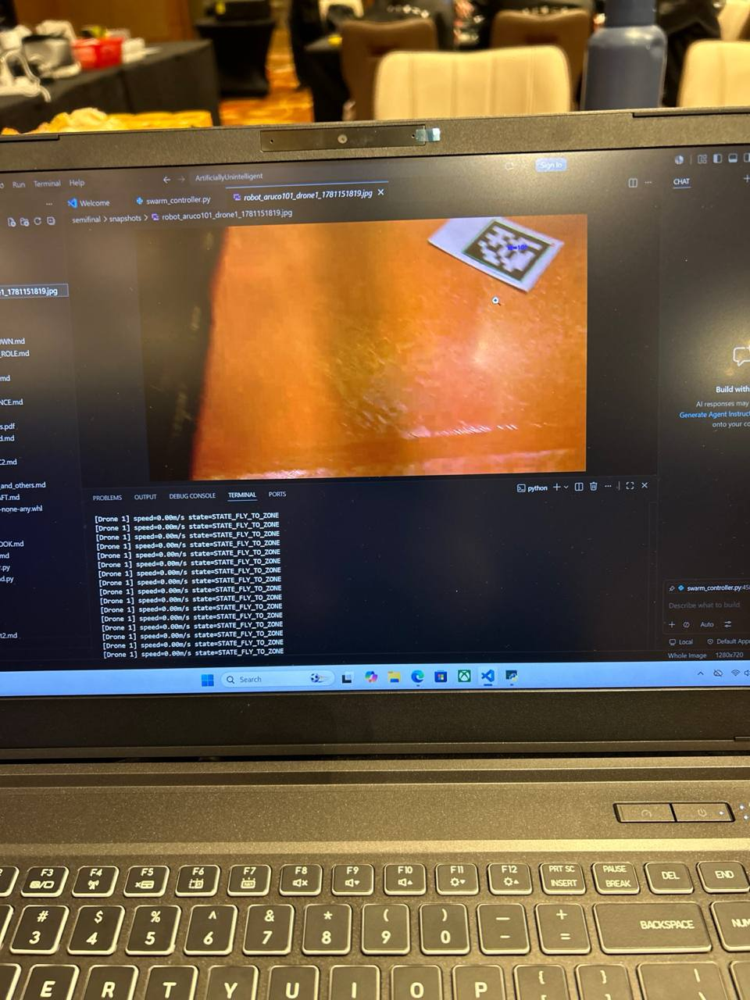

# Challenge 2 — Hula swarm

<p align="center">
<a href="{{ '/' | relative_url }}">← Home</a> &nbsp;·&nbsp;
<a href="#what-we-knew-vs-what-was-clarified-late">Late drops</a> &nbsp;·&nbsp;
<a href="#architecture-overview">Architecture</a> &nbsp;·&nbsp;
<a href="#phase-a--deployment-challenge-2a">Deploy</a> &nbsp;·&nbsp;
<a href="#phase-b--hunt-challenge-2b">Hunt</a> &nbsp;·&nbsp;
<a href="#convoy-operator-role-slot-24">Convoy</a>
</p>

> Two halves. **2A — Deployment:** land three Hula drones on three valid pads. **2B — Ambush:** hunt five RoboMaster ground robots and tag each with a snapshot of its on-body ArUco marker.

---

## What we knew vs. what was clarified late

Challenge 2 had several late-breaking surprises from the org's Discord:

| Drop | Date | Impact |
|---|---|---|
| RoboMasters carry **ArUco markers**, not coloured silhouettes — `cv2.aruco`, not custom YOLO | 2026-06-06 | A's YOLO track demoted to insurance only |
| ArUco markers placed *beside* every Hula landing pad too (mirroring C1) — usable as visual landing aid | 2026-06-06 | Same `cv2.aruco` path reused for landing confirmation |
| **Map layout not provided** — arena dimensions discovered live | 2026-06-06 | Coverage strategies must not depend on a-priori dimensions |
| Markers are **20 cm × 20 cm**; exact dictionary announced on the day | 2026-06-06 | Multi-dict scan path planted as hedge |
| **2 of 5 ground robots driven by another team** as adversarial convoy operators; we drive 2 in their slot | Slide 14 | New role: Convoy operator |

Our swarm design accommodates all of these — ArUco-first detection, UWB-positioned landing with visual confirmation, no hard dependence on arena dimensions.

---

## Architecture overview

<p align="center">

<br><sub><i>The swarm controller live on Day 2 · per-drone state in the terminal · fresh ArUco hit on a RoboMaster body in the image pane</i></sub>
</p>

```
 dola.py (UDP discovery: plane_id → IP)
        │
        ▼
 swarm_controller.py  ── per-drone state machine ───────────────
   Phase A (DEPLOY): UWB → fly to landing zone → visual confirm → land
   Phase B (HUNT):   perimeter waypoints + 360° spin-scan
        │  position from ──► UWBParserThread.py (tag_id → x, y)
        │  motion via ─────► pyhula  send_manual_control
        ▼
   central video: all drones' streams aggregated → ArUco detection
```

> 💡 **Why a single central detector?** Multi-stream from one machine simplifies dedup (one detection table, not three), and lets us add expensive visual sanity checks (multi-frame confirmation) cheaply.

---

## Phase A — Deployment (Challenge 2A)

### Inputs

| Source | What it provides |
|---|---|
| **Org Discord** | The 5 landing-pad coordinates |
| **Org briefing** | The validity split — which 3 of the 5 are valid |
| **From C1** | `landing_pads.json` — cross-check of the validity split + world coords (same UWB frame) |

### Per-drone state machine

```
IDLE → TAKEOFF → CRUISE_TO_ZONE → APPROACH → ARUCO_VISUAL_LOCK → DESCEND → LANDED
                                       │                                 │
                                       └── timeout / no lock ──► HOLD ──┘
```

| State | What happens |
|---|---|
| `CRUISE_TO_ZONE` | UWB-driven `send_manual_control` velocity vectors toward the landing-pad coordinate @ **0.5 m/s** cap (org rule). Altitude **1.1 m** (org-recommended) — well below the cage net. |
| `APPROACH` | Slow profile into the final 1 m horizontally with altitude held. |
| `ARUCO_VISUAL_LOCK` | Confirm we see the pad's own ArUco marker in the down-facing camera before committing to descent. |
| `DESCEND` | Controlled descent with horizontal hold; pyhula handles the touchdown. |

> ⚠️ **No flying over obstacles** (slide 6). Waypoint planner keeps every drone over open floor — the deployment path is a direct UWB-frame straight line from takeoff to each zone.

### Coordination across 3 drones

Drones launch staggered to avoid mid-air conflict; each operates an independent state machine with no peer-to-peer talk. The shared resources are the central video pipeline and the swarm controller's main loop, which dispatches events back to each per-drone task.

---

## Phase B — Hunt (Challenge 2B)

### Inputs

| Type | Count | Notes |
|---|---|---|
| Autonomous RoboMasters | 3 | Follow an autonomous patrol |
| Adversarial RoboMasters | 2 | Another team driving with intent to evade us |

Each carries an ArUco marker on its top surface.

### Strategy

Per drone:

1. **Perimeter waypoints** at 1.1 m altitude trace the cage interior just inside the obstacle ring.
2. **360° spin-scan** at each corner — a slow yaw rotation with the down-camera streaming continuously to the central detector.
3. The central detector runs `cv2.aruco` on the aggregated video and emits `(robomaster_id, detected_at_drone_n, world_xyz, frame_jpeg)` events.
4. Each robot is confirmed via **2–3 frames** to reject noise.

Detection coverage is *temporal* (the spin) and *spatial* (3 drones at 3 corners cover the cage from different angles, defeating one-side ArUco occlusion).

### Snapshots = judge artifact

Per slide 7 of the org's brief, *"teams will have to print the outputs from the Aruco marker on the ground robot to represent successful tagging."* For each confirmed RoboMaster we save:

- The full frame with the marker's bounding box and ID overlay.
- The world coordinate at detection time.
- A timestamp.

All saved to the run directory, copied to USB, presented to the judge.

---

## Convoy operator role (slot #24)

> 🎮 **Operationally the *fun* slot of the day.**

Our schedule includes a second responsibility on Day 2: at slot #24 we operate two convoy RoboMasters *against* THE WIENERS. The same role STD plays against us at our slot #3.

Our convoy strategy:

- Two of us split the cage half each.
- Keep moving — don't sit still long enough to be tagged.
- Stay near obstacles where Hulas can't approach from above (no flying over obstacles, slide 6).
- Track the opposing Hula's perimeter waypoints by ear (Hula motor pitch) and zig away from its sweep.

---

## Speed + altitude caps (Hula)

| Constraint | Value | Source |
|---|---|---|
| Max speed | **0.5 m/s** | Org slide 6 |
| Recommended altitude | **1.1 m** | Org slide 6 |
| No flying over obstacles | **Hard rule** | Org slide 6 — path planning respects obstacle footprints |
| Per-attempt cap | **8 min** | Org slide 6 |

---

<p align="center">
<a href="{{ '/' | relative_url }}">← Home</a>
&nbsp;·&nbsp;
<a href="{{ '/c1-mapping' | relative_url }}">← Challenge 1</a>
&nbsp;·&nbsp;
<a href="{{ '/principles' | relative_url }}">Design principles →</a>
</p>
