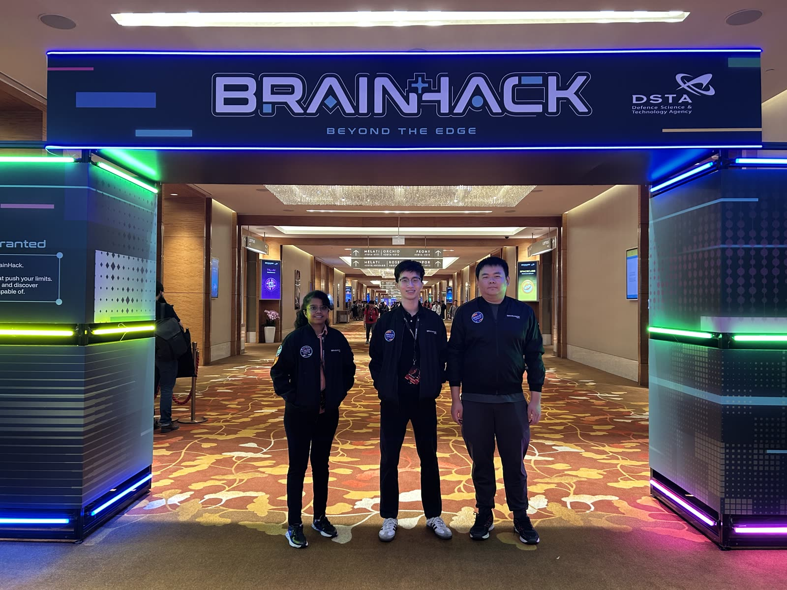
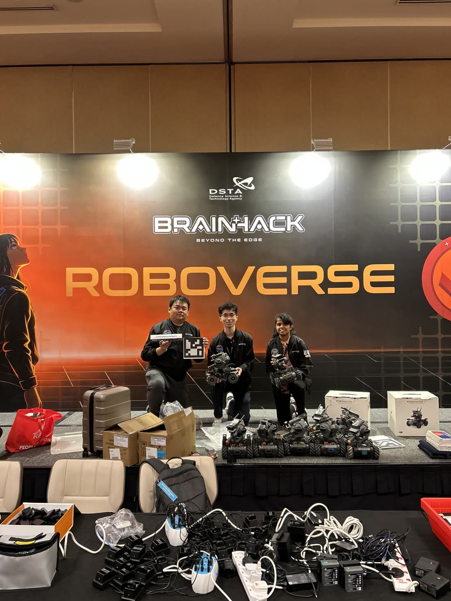
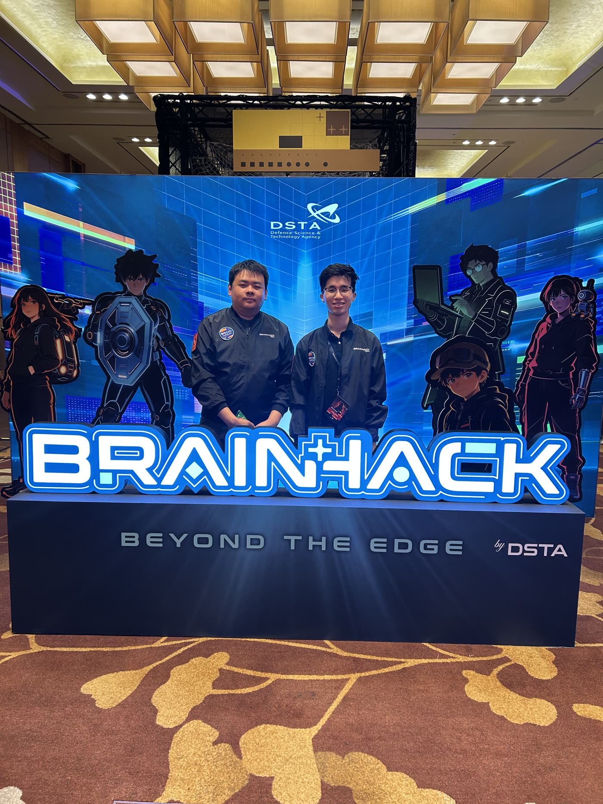
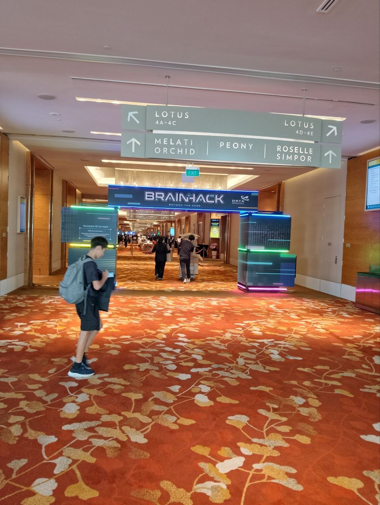
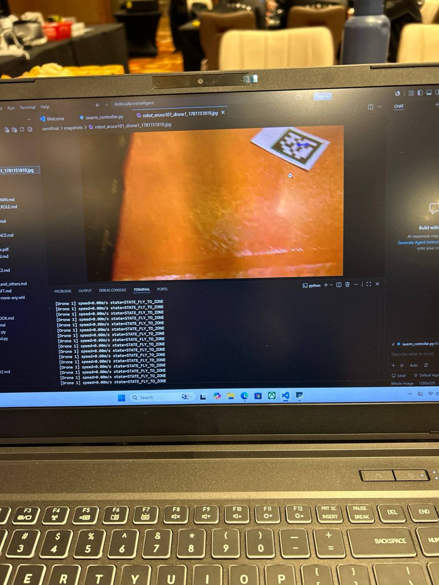
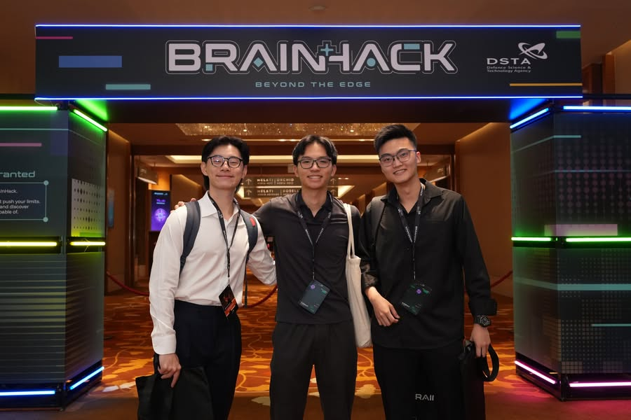
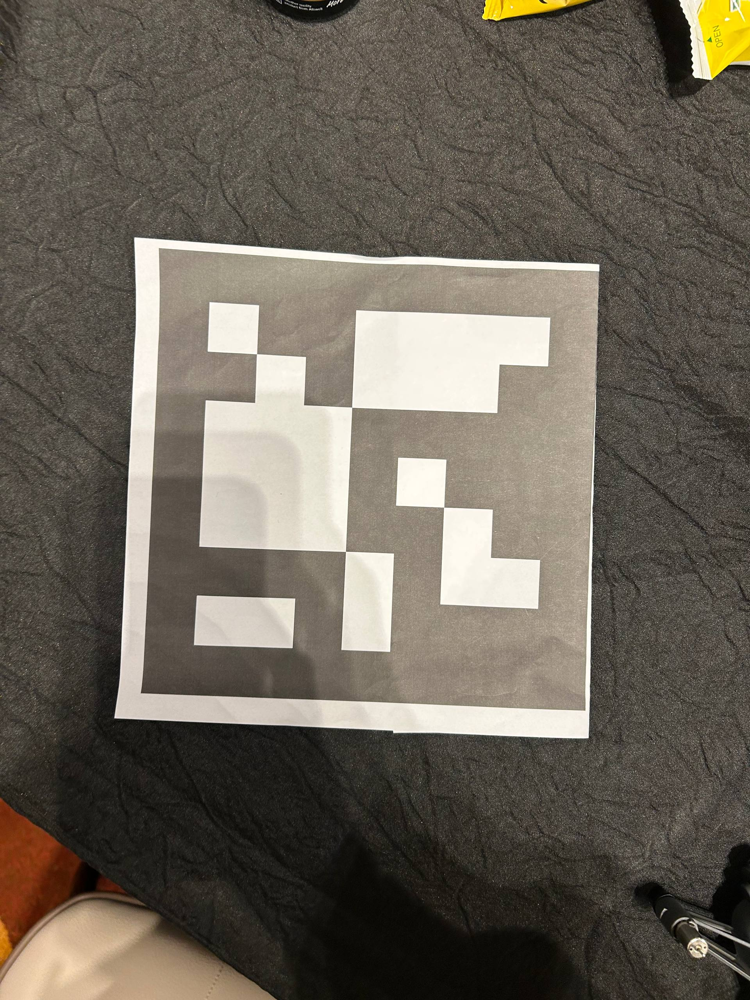

# Gallery

A selection of photos from BrainHack 2026 RoboVerse — Marina Bay Sands Expo Level 4, 10–11 June 2026.

Most are our own. The DSTA-credited photo is from DSTA's official album of the event.

  <a class="gallery-item span-8" href="images/gallery-arch-wide.jpg" target="_blank" rel="noopener">
    
    <figcaption>Under the BRAINHACK arch · Day 1 setup</figcaption>
  </a>

  <a class="gallery-item span-4" href="images/gallery-roboverse-portrait.jpg" target="_blank" rel="noopener">
    
    <figcaption>Team + hardware · ROBOVERSE backdrop</figcaption>
  </a>

  <a class="gallery-item span-6" href="images/gallery-character-backdrop.jpg" target="_blank" rel="noopener">
    
    <figcaption>BrainHack character backdrop</figcaption>
  </a>

  <a class="gallery-item span-6" href="images/hero-venue.jpg" target="_blank" rel="noopener">
    
    <figcaption>Venue arrival · Day 1 morning</figcaption>
  </a>

  <a class="gallery-item span-6" href="images/swarm-controller-live.jpg" target="_blank" rel="noopener">
    
    <figcaption>Swarm controller live · ArUco hit · Day 2</figcaption>
  </a>

  <a class="gallery-item span-6" href="images/convoy-robomasters.jpg" target="_blank" rel="noopener">
    
    <figcaption>Convoy RoboMasters with ArUco markers</figcaption>
  </a>

  <a class="gallery-item span-6" href="images/hero-arch-dsta.jpg" target="_blank" rel="noopener">
    
    <figcaption>Photo: DSTA · BrainHack 2026 album</figcaption>
  </a>

  <a class="gallery-item span-6" href="images/aruco-marker-printed.jpg" target="_blank" rel="noopener">
    
    <figcaption>20 cm ArUco · DICT_7X7_1000</figcaption>
  </a>

---

  Most photos are by the team. The "Photo: DSTA" tile is from DSTA's official album. 
  Click any tile for the full-size image. More from the org's album at <a href="https://www.facebook.com/SingaporeDSTA/posts/1343148077996379/" target="_blank" rel="noopener">facebook.com/SingaporeDSTA</a>.

