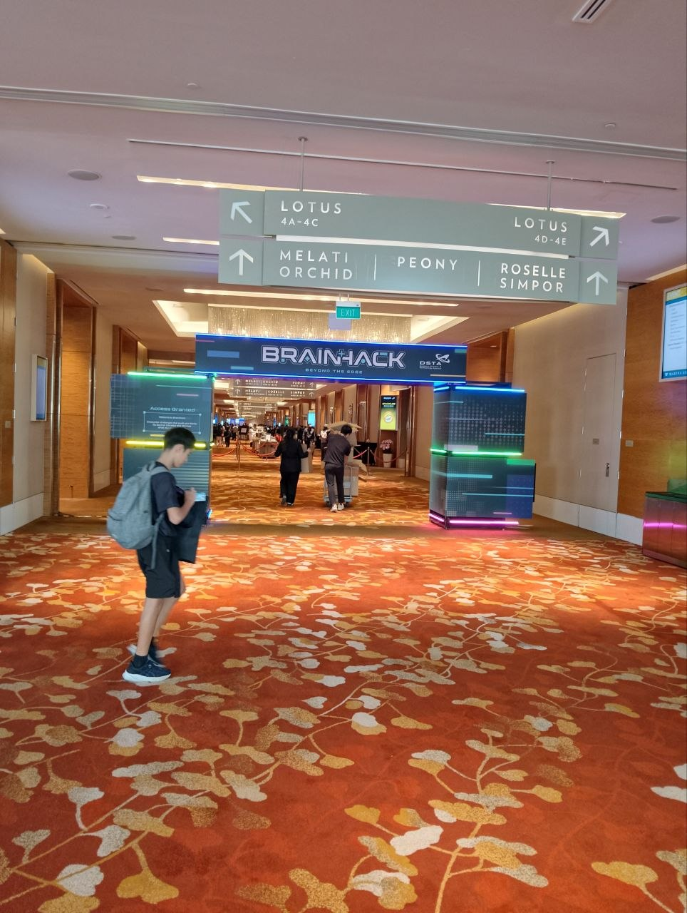
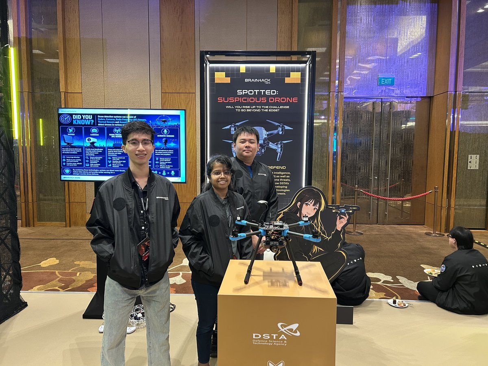

# ArtificiallyUnintelligent

**RoboVerse Drone Challenge · BrainHack 2026 · University Finals**
*Marina Bay Sands Expo, Level 4 · 10–11 June 2026*

<a href="#what-we-built">What we built</a> &nbsp;·&nbsp;
<a href="#five-design-principles">Principles</a> &nbsp;·&nbsp;
<a href="#at-a-glance">At a glance</a> &nbsp;·&nbsp;
<a href="#dive-deeper">Pages</a> &nbsp;·&nbsp;
<a href="#team">Team</a>

> A two-stage autonomous drone mission. First, a mapping drone surveys the arena and classifies which landing pads are valid. Then a swarm of three Hula drones lands on the valid pads and hunts a convoy of ground robots. Two challenges, one coordinate world, one intelligence-driven pipeline.

 <i>Day 1 · MBS Expo Level 4 · approaching the BRAINHACK arch and the DSTA Roboverse zone</i>

---

## What we built

Two operational halves of a modular, redundant autonomy stack:

> **Challenge 1 — Reconnaissance**
> A mapping drone (Realsense + UWB + PX4 over MAVSDK) flies a deterministic lawnmower sweep at controlled altitude, deprojects depth into a top-down occupancy grid, scans every frame for ArUco markers in two dictionaries, and writes a machine-readable `landing_pads.json` describing each pad's world coordinates and validity.

> **Challenge 2 — Deployment & Ambush**
> A swarm of three Hula drones takes the recon output, lands on three valid pads, then transitions into a wall-following + 360° spin-scan hunt for five RoboMaster ground robots — each carrying an ArUco marker — with all video aggregated centrally for detection.

Both stages share the **same arena UWB frame** (origin = centre). The C1 → C2 handoff is a coordinate lookup, not a re-survey.

---

## Five design principles

| # | Principle | What it prevents |
|---|---|---|
| **1** | Intelligence drives the strike | Building C1 and C2 independently and re-surveying twice |
| **2** | Coverage over cleverness | Reactive-sensing failures from see-through netting |
| **3** | Degrade, don't fail | Single-point hardware drops ending the run |
| **4** | Safe-first | Crash → zero points → no recovery |
| **5** | Frame discipline | Silent axis errors that look like "everything is wrong" |

[Full design rationale → Design principles]({{ '/principles' | relative_url }})

---

## At a glance

| | Challenge 1 — Mapping | Challenge 2 — Swarm |
|---|---|---|
| **Hardware** | 1 mapping drone · Realsense D430/D450 · UWB tag · RKNN NPU | 3 Hula drones · central video aggregation |
| **Pose** | FC-NED fused ↔ UWB ENU→NED (auto-switching) | UWB serial (`tag_id → x,y`) |
| **Control** | MAVSDK offboard · velocity setpoints @ 0.3 m/s cap | pyhula `send_manual_control` |
| **Detection** | `cv2.aruco` (DICT_7×7_1000 + 6×6_250) on depth-deprojected frames | ArUco on aggregated drone video |
| **Path** | Lawnmower sweep · centred-origin waypoints | Wall-follow + 360° spin-scan |
| **Output** | `top_down.png` + `landing_pads.json` (judge artifact) | Snapshot per detected RoboMaster |

[System architecture diagram → Architecture]({{ '/architecture' | relative_url }})

---

## Dive deeper

- 📐 [**Architecture**]({{ '/architecture' | relative_url }}) — full system diagram, module-by-module
- 🛰 [**Challenge 1 — Mapping drone**]({{ '/c1-mapping' | relative_url }}) — algorithms + flight envelope + redundancy
- 🤖 [**Challenge 2 — Hula swarm**]({{ '/c2-swarm' | relative_url }}) — deploy + hunt + central detection
- 📏 [**Design principles**]({{ '/principles' | relative_url }}) — the five rules driving every decision
- 🛠 [**Engineering log**]({{ '/engineering' | relative_url }}) — trade-offs, prep-week surprises, lessons

---

## Team

**ArtificiallyUnintelligent** — three-person team, University category.

| | Role |
|---|---|
| **Z** | Challenge 1 mapping drone · cross-platform glue · runbook |
| **K** | Challenge 2 Hula swarm controller · on-day pilot |
| **A** | Operations · concept submission · judge interface |

 <i>The team at the Counter-UAS demo station — DSTA Tech Showcase, MBS Expo Level 4</i>

---

Source: <a href="https://github.com/zhengboon/ArtificiallyUnintelligent">github.com/zhengboon/ArtificiallyUnintelligent</a> · this site is generated from <code>/docs</code> via GitHub Pages

