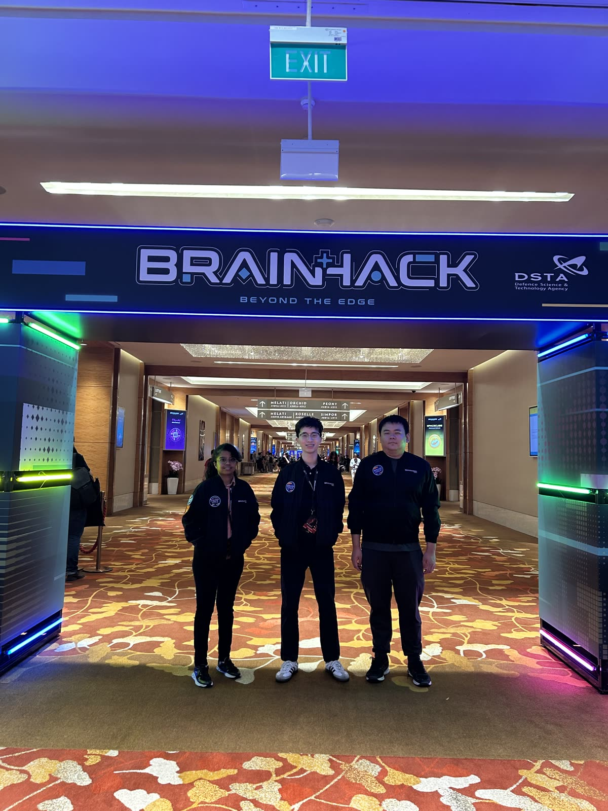
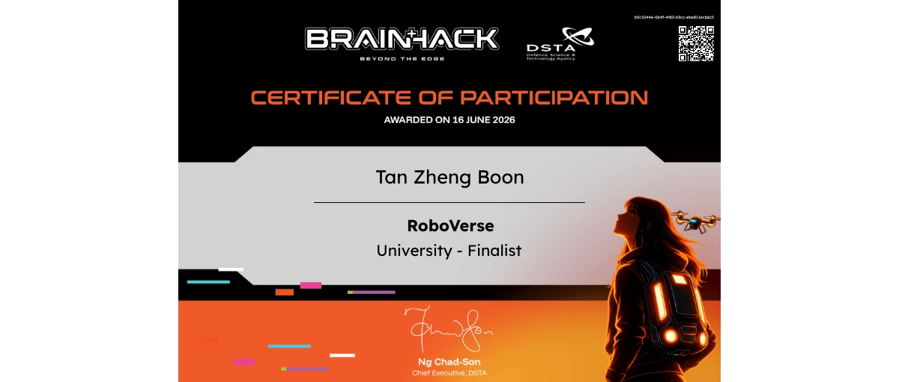

<section class="hero">
  

    

      BrainHack 2026 · RoboVerse · University Finals
      <h1>Two drones. One coordinate world.</h1>
      
A mapping drone surveys the arena and classifies the landing pads. Then a swarm of three Hula drones lands on the valid pads and hunts a convoy of ground robots. Two challenges, one intelligence-driven pipeline.

      

        <a class="btn btn-primary" href="{{ '/architecture' | relative_url }}">See the architecture</a>
        <a class="btn btn-secondary" href="https://github.com/zhengboon/ArtificiallyUnintelligent" target="_blank" rel="noopener">View on GitHub</a>
      

    

    <figure class="hero-photo">
      
      <figcaption class="hero-photo-caption">ArtificiallyUnintelligent · BRAINHACK arch · MBS Expo L4</figcaption>
    </figure>
  

</section>

## What we built

Two operational halves of a modular, redundant autonomy stack:

> **Challenge 1 — Reconnaissance**
> A mapping drone (Realsense + UWB + PX4 over MAVSDK) flies a deterministic lawnmower sweep at controlled altitude, deprojects depth into a top-down occupancy grid, scans every frame for ArUco markers in two dictionaries, and writes a machine-readable `landing_pads.json` describing each pad's world coordinates and validity.

> **Challenge 2 — Deployment & Ambush**
> A swarm of three Hula drones takes the recon output, lands on three valid pads, then transitions into a wall-following + 360° spin-scan hunt for five RoboMaster ground robots — each carrying an ArUco marker — with all video aggregated centrally for detection.

Both stages share the **same arena UWB frame** (origin = centre). The C1 → C2 handoff is a coordinate lookup, not a re-survey.

---

## Five design principles

| # | Principle | What it prevents |
|---|---|---|
| **1** | Intelligence drives the strike | Building C1 and C2 independently and re-surveying twice |
| **2** | Coverage over cleverness | Reactive-sensing failures from see-through netting |
| **3** | Degrade, don't fail | Single-point hardware drops ending the run |
| **4** | Safe-first | Crash → zero points → no recovery |
| **5** | Frame discipline | Silent axis errors that look like "everything is wrong" |

[Full design rationale →]({{ '/principles' | relative_url }})

---

## At a glance

| | Challenge 1 — Mapping | Challenge 2 — Swarm |
|---|---|---|
| **Hardware** | 1 mapping drone · Realsense D430/D450 · UWB tag · RKNN NPU | 3 Hula drones · central video aggregation |
| **Pose** | FC-NED fused ↔ UWB ENU→NED (auto-switching) | UWB serial (`tag_id → x,y`) |
| **Control** | MAVSDK offboard · velocity setpoints @ 0.3 m/s cap | pyhula `send_manual_control` |
| **Detection** | `cv2.aruco` (DICT_7×7_1000 + 6×6_250) on depth-deprojected frames | ArUco on aggregated drone video |
| **Path** | Lawnmower sweep · centred-origin waypoints | Wall-follow + 360° spin-scan |
| **Output** | `top_down.png` + `landing_pads.json` (judge artifact) | Snapshot per detected RoboMaster |

[System architecture →]({{ '/architecture' | relative_url }})

---

## By the numbers

  
5Days of prep

  
3Teammates

  
2Drone platforms

  
~140Commits

  
~3.5kC1 LOC

  
20ArUco dicts supported

  
5Safety watchdogs

  
11Org clarifications handled live

---

## Dive deeper

- [**Architecture**]({{ '/architecture' | relative_url }}) — full system diagram, module-by-module
- [**Challenge 1 — Mapping drone**]({{ '/c1-mapping' | relative_url }}) — algorithms + flight envelope + redundancy
- [**Challenge 2 — Hula swarm**]({{ '/c2-swarm' | relative_url }}) — deploy + hunt + central detection
- [**Design principles**]({{ '/principles' | relative_url }}) — the five rules driving every decision
- [**Engineering log**]({{ '/engineering' | relative_url }}) — trade-offs, prep-week surprises, lessons
- [**Gallery**]({{ '/gallery' | relative_url }}) — venue, team, hardware, swarm controller in the wild

---

## Team

**ArtificiallyUnintelligent** — three-person team, University category.

| | Role |
|---|---|
| **Z** | Challenge 1 mapping drone · cross-platform glue · runbook |
| **K** | Challenge 2 Hula swarm controller · on-day pilot |
| **A** | Operations · concept submission · judge interface |

 <i>The team in front of the RoboVerse backdrop — one ArUco marker, one RoboMaster, and the rest of the day's hardware on the platform</i>

---

## Recognition

DSTA issued every team member a verifiable digital **University Finalist** credential via Credsverse — awarded 16 June 2026, signed by Ng Chad-Son, Chief Executive of DSTA. Click any card to verify on Credsverse.

  <a class="cred-card" href="https://credsverse.com/credentials/b5c1044e-0b4f-4f63-b3cc-ebe811ecb6c5?recipient=true" target="_blank" rel="noopener">
    
    

      
Tan Zheng Boon

      
BrainHack 2026 · RoboVerse · University Finalist

      Verify on Credsverse →
    

  </a>
  <a class="cred-card" href="https://credsverse.com/credentials/d6868a57-8741-47a8-b6b7-4feeac665ce9" target="_blank" rel="noopener">
    
    

      
Bock Kai Sheng

      
BrainHack 2026 · RoboVerse · University Finalist

      Verify on Credsverse →
    

  </a>
  <a class="cred-card" href="https://credsverse.com/credentials/6a469f62-90b4-40dc-a9a1-1b009fd67acd" target="_blank" rel="noopener">
    
    

      
Abirami Baskaran

      
BrainHack 2026 · RoboVerse · University Finalist

      Verify on Credsverse →
    

  </a>

